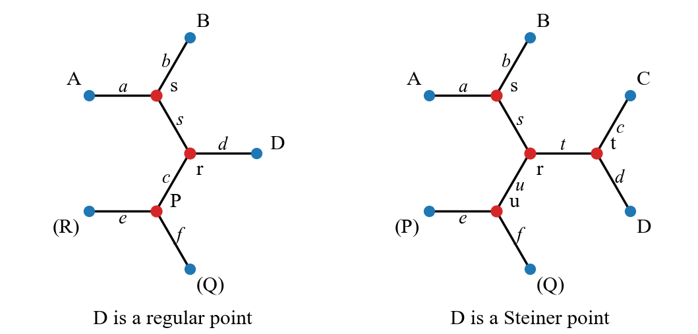

# Towards Solving the Gilbert-Pollak Conjecture via Large Language Models

The directory contains two folders `certificate/` and `pipeline/`.

- 📃 If you want to quickly verify our theoretical result $\rho = 0.8559$, please refer to the `certificate/` folder;
- 🤖 If you want to understand how our LLM-Agent pipeline works, please refer to the `pipeline/` folder.

## 📃 Certificate



Please refer to Figure 10 in the paper to understand how we deal with geometric spaces. Note that variable names in the code have a little difference from those in the paper. Please refer to the picture above for mapping.

There are 2 subfolders `d_regular/` and `d_steiner/` here, corresponding to two cases.

If you want to run the full verification, please run the following 4 files in order:

```
cd d_regular

make plot_f_le_d
./plot_f_le_d       # Case 1.1: D regular, f <= d  

make plot_f_ge_d
./plot_f_ge_d       # Case 1.2: D regular, f >= d

cd ..
cd d_steiner

make plot_f_le_t
./plot_f_le_t       # Case 2.1: D Steiner, f <= t

make plot_f_ge_t
./plot_f_ge_t       # Case 2.2: D Steiner, f >= t
``` 

Note that the complete process may take dozens of hours.

## 🤖 Pipeline

Please refer to Figure 10 and Appendix F in the paper to understand our experimental setup. Our code will work with $D$ is regular and $f = d$.

**🚀 Quickstart:** 

Please install [GeoSteiner 5.3](http://www.geosteiner.com/) to `geosteiner-5.3/`.

For Windows users, please set up WSL first. The following commands will run the full pipeline.

```
make clean
make
python evolve_wsl.py --iterations 20            # For Windows. Iterate <= 20 round
python evolve.py --iterations 20                # For Linux
python evolve_wsl.py --iterations 10 --start 10 # Start from iteration 10 (if interrupted)
```

The output of LLM will be in `evolve_resp_<X>/`. Extracted Lemma will be in `formulas/F_X`. After each iteration, `bottleneck.txt`, `rho.txt`, and temporary reward model code `plot_gen_X.cpp` will be generated. All useful information during the process will be recorded in the `log` file.

Here are some information of each file:

* `plot.cpp`: Oracle called by Reward Model. Calculate whether the Steiner ratio is greater than or equal to rho based on all current splits. The split code is in the `formulas` folder, where `F0`,... represent the newly added splits from each improvement.

* `binsearch.py`: **⚙️ Reward Model.** A script that performs binary search to find the Steiner ratio by calling `plot.cpp`.

* `calc.py`: Convert lemma to verification functions. Create new `formulas/Fi`.
  - If adding a new condition for the existence of a regular point, put the code in `tmp/x_cond`, implementing the functions `double X_cond(a2, a3, a4)` and `double AX_upper_bound(a2, a3, a4)`.
  - If adding a new s_plus, put the s_plus in `tmp/s_plus`, and put the condition and length of s_plus in `tmp/s_cond`, implementing the functions `bool steiner_cond(b, c, d, s, e)` and `double steiner_length(b, c, d, s, e)`.

* `split_rho.cpp`: Given `b, c, d, s, e`, calculate the rho of all splits at that point. Note: This file can only be compiled on Linux; it will fail on Windows.

* `llm.py`: **💡 LLM Agent.** Run LLM to find conditions for the existence of regular points or legality of s_plus.

* `extract.py`: Extract conditions from LLM output to generate `tmp/x_cond` or `tmp/s_cond`.

* `splits.txt`: Record information of all splits.

* `splits4.txt`: Record information of all splits with splus size of 4. Note that the points in splus should be in clockwise order.

* `regular_point_prompt.txt`: Prompt for finding conditions for the existence of regular points.

* `splus_prompt.txt`: Prompt for finding legality conditions for s_plus.

* `evolve.py`: Fully automated iterative process on Linux.

* `evolve_wsl.py`: Fully automated iterative process on Windows Subsystem for Linux.


